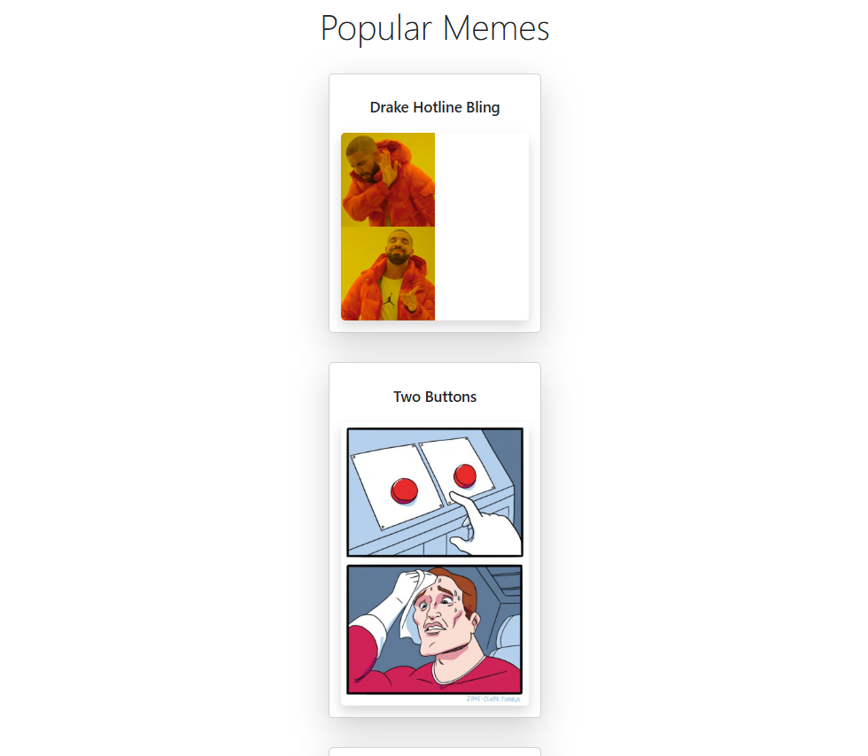

# Project - Memes 🚀

This project was created as a practical exercise for my course, following the professor's instructions. It's a first look into handling JSON data from a public API. The application fetches memes from an external source and displays them on a user-friendly interface built with HTML, Bootstrap, and JavaScript. [Site Example](https://github.com/bootcampfullstack/bootcamp-devjr-modulo6-memes/blob/main/Memes.png). 

---

## Final Result:



---

## JavaScript, getting JSON element: 

```js
$.getJSON("https://api.imgflip.com/get_memes", (response) => {

    for (let m of response.data.memes) {
        document.getElementById("memes").innerHTML += 
            `<br><div class="card m-auto p-3 shadow-lg mb-3" style="width: 18rem;">
                <div class="card-body">
                    <h5 class="card-title text-center">${m.name}</h5>
                </div>
                            
            </div>`;
    }

});
```
